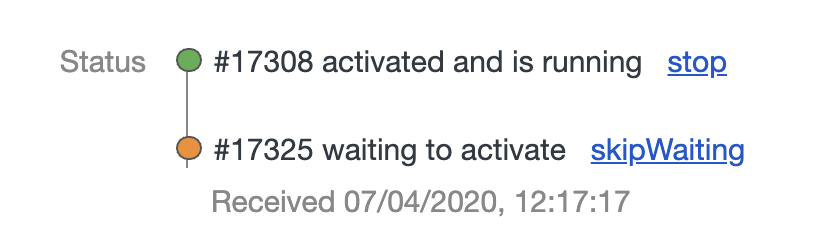

# Vue CLI Genearted App

## BEFORE YOU START PRESENTATION

```bash
yarn build
npx serve dist
```

Open developer tools `Application` tab and clear out

Storage/Local Storage

- Storage/Session Storage
- Storage/IndexdDB
- Cache/Cache Storage/pwa-app-vue-precache
- Serive worker for localhost:5000
- Delete dist folder

## Branch 1-cli-created

### Out of the box (CLI)

All the bits and pieces are there.

- Workbox has been added as part of Vue Plugin `@vue/cli-plugin-pwa`
- A build that auto generates a service worker `yarn build`

However running `yarn serve` will not create a service worker as the Vue CLI plugin only runs up a service worker for production.

See `src/registerServiceWorker.js`

Also this shows various hooks and logs out thier purpose.

Try the following at the command line

```bash
yarn build
npx serve dist
```

You should be prompted that your application is running on <http://localhost:5000>

Open the developer tools `Application` tab and show

1. Service worker

   - Status
   - Lifecycle

1. Cache/Cache Storage

   - HTML
   - JS
   - CSS
   - Images
   - Manifest (see PWA manifest) <https://developer.mozilla.org/en-US/docs/Web/Manifest>

Take offline... you now have an offline web page. While a purely offline experience may not be what you want, it does give you the opportunity to support some features when a user has limited connectivity.

> NOTE: No logic to determine whether or not our application runs totally offline. The hooks in registerServieWorker can be used to augment this behaviour.

## 2-unamed

For convenience let's adjust our package.json to build and serve.

Replace

```json
    "serve": "vue-cli-service serve",
```

with

```json
    "dev": "vue-cli-service serve",
    "serve": "vue-cli-service build; npx serve dist",
```

View your service worker, run `yarn serve` from the command line and note nothing changes.

Before moving on lets take a look at the console you should see a number of messages posted by the service worker.

```txt
> workbox Precaching is responding to: /css/app.072b4354.css

> workbox Precaching is responding to: /js/app.e7c1cca0.js

> workbox Precaching is responding to: /js/chunk-vendors.6e51c008.js

> workbox Precaching is responding to: /manifest.json

App is being served from cache by a service worker. registerServiceWorker.js:8
For more details, visit https://goo.gl/AFskqB

For more details, visit https://goo.gl/AFskqB
registerServiceWorker.js:14

```

Precaching is the default approach taken by workbox, caching your files before the new service worker is used. Like most things in workbox it can be configured, but out of the box it precaches everything.

Causing an update. The build provided by the CLI is currently determining if anything has changed and updating the hash/version of the service worker.

Change the background color of #app in `src/App.vue`. Stop serving the application and re-run `yarn serve



Take a look at the console you should see a number of messages posted by the service worker.

```txt
App is being served from cache by a service worker. app.44777ddd.js?__WB_REVISION__=a929f9a3b4f55f5cf390:1
For more details, visit

Service worker has been registered. app.44777ddd.js?__WB_REVISION__=a929f9a3b4f55f5cf390:1

New content is downloading. https://goo.gl/AFskqB app.44777ddd.js?__WB_REVISION__=a929f9a3b4f55f5cf390:1

> workbox Precaching 3 files. 4 files are already cached. logger.mjs:44

New content is available; please refresh. app.44777ddd.js?__WB_REVISION__=a929f9a3b4f55f5cf390:1

```

We could choose to skip waiting, but that's not really an experience a user will have.
